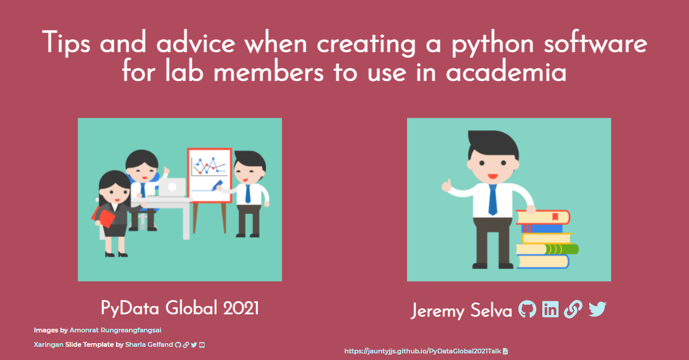

```{r, include = FALSE}
knitr::opts_chunk$set(
  collapse = TRUE,
  comment = "#>",
  fig.align = 'center'
)
```

# PyData Global 2021 slides

Here are the source code for my [slides](https://jauntyjjs.github.io/PyDataGlobal2021Talk) presented at [PyData Global 2021](https://pydata.org/global2021/)


