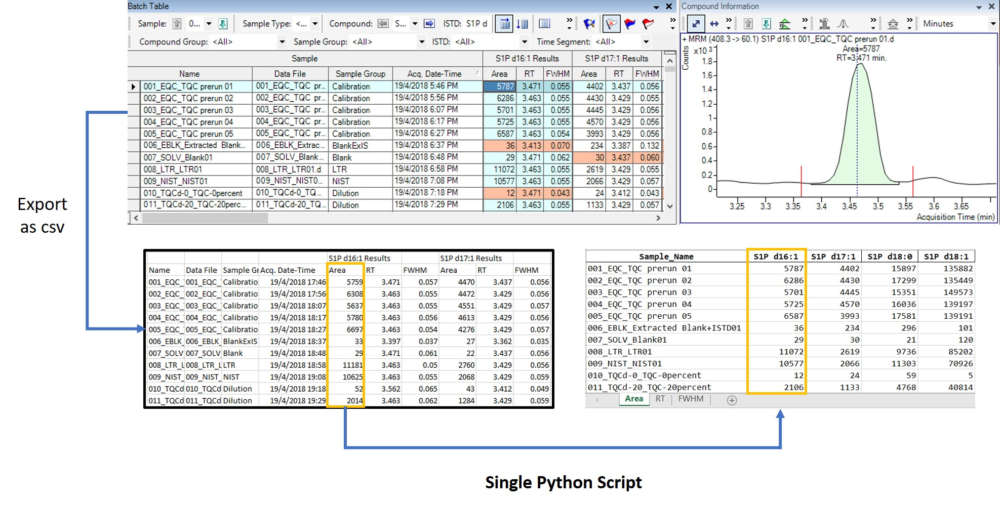
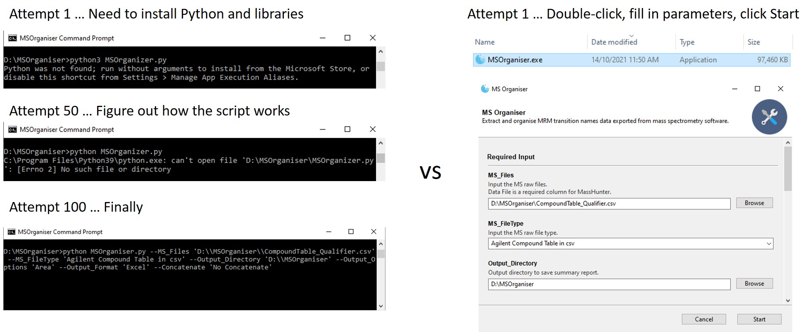
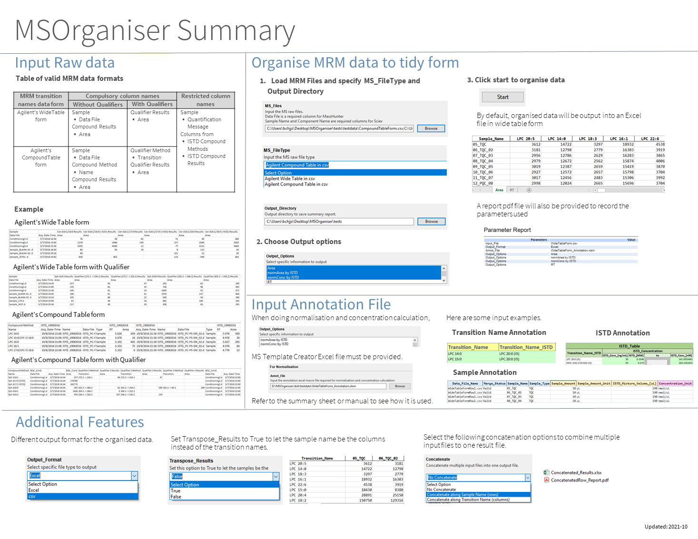
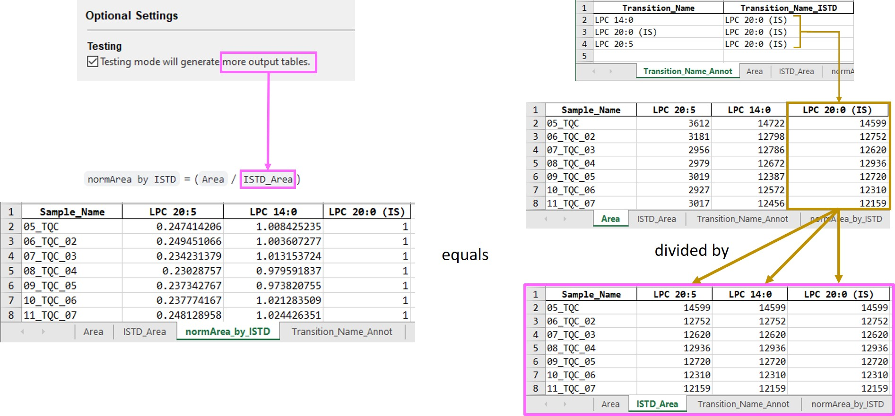
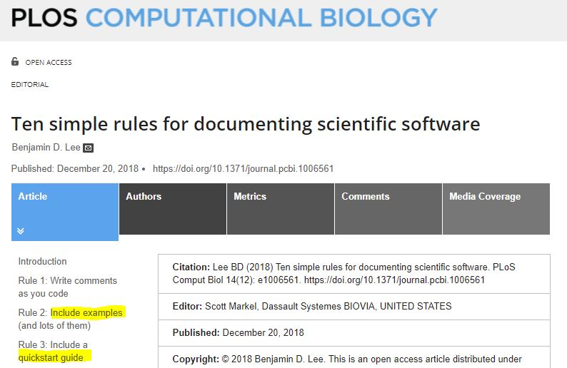

class: middle, center, inverse

# Tips and advice when creating a python software for lab members to use in academia

```{r setup, include=FALSE}
options(htmltools.dir.version = FALSE)
knitr::opts_chunk$set(echo = FALSE, fig.align = "center", out.width = "90%")
```

```{r xaringan-themer, include=FALSE, warning=FALSE}
library(xaringanthemer)
style_mono_accent(
  base_color = "#b04b5d",
  header_font_google = google_font("Josefin Sans", "300"),
  text_font_google   = google_font("Lato", "600", "600i"),
  code_font_google   = google_font("Fira Mono"),
  link_color = "blue",
  footnote_color = NULL,
  footnote_font_size = "0.5em",
  footnote_position_bottom = "10px",
)
```


.pull-left[
```{r, out.width = "70%"}
knitr::include_graphics("images/business-team.jpg")
```


### Something Else
]


.pull-right[
```{r, out.width = "70%"}

```

### @SelvaJeremy
]

.left[.footnote[Images by [Amonrat Rungreangfangsai](https://www.vecteezy.com/members/amy1313)]]

---
## Introduction

It started with creating a python script used to organise Mass Spectrometry data for my project.

```{r, out.width = "80%"}

```

.center[.headnote[https://jauntyjjs.github.io/PyDataGlobal2021Talk]]
---

## Introduction

Many asks me to fix/run similar scripts created by past lab members.
- *"This script does not work on my computer anymore. I don't know why."* 😵

.pull-left[

```{r, out.width = "80%"}

```

]

.pull-right[

```{r, out.width = "80%"}

```

]

.left[.footnote[Images by [Amonrat Rungreangfangsai](https://www.vecteezy.com/members/amy1313)]]

---

## Introduction

I combined all these scripts into one Windows executable software in Python called [MSOrganiser](https://github.com/SLINGhub/MSOrganiser).

.pull-left[
```{r, out.width = "100%"}

```
]

.pull-right[

```{r, out.width = "60%"}

```

.center[
https://github.com/SLINGhub/MSOrganiser
]

]

.left[.footnote[Images by [Amonrat Rungreangfangsai](https://www.vecteezy.com/members/amy1313)]]

---

## Introduction

Looking back, I realised that things have not been easy...


```{r, out.width = "50%"}

```

.left[.footnote[Images by [Amonrat Rungreangfangsai](https://www.vecteezy.com/members/amy1313)]]
---

## Introduction

In academia, most of us are not trained in coding or software development. It is hard for us to write software for our own research paper, it is even more challenging to create software for others to use.

.pull-left[

Daniel Lemire’s [blog](https://lemire.me/blog/2012/06/18/on-the-quality-of-academic-software/)

```{r, out.width = "80%"}

```
]

.pull-right[

```{r, out.width = "90%"}
knitr::include_graphics("images/programming-hard.jpg")
```

]

.left[.footnote[Images by [Amonrat Rungreangfangsai](https://www.vecteezy.com/members/amy1313)]]

---

## Introduction

In this talk, I decide to share some things that have helped me tremendously.


```{r, out.width = "50%"}

```

.left[.footnote[Images by [Amonrat Rungreangfangsai](https://www.vecteezy.com/members/amy1313)]]

---
## Convert scripts to a web service or executable software

Users make less error when clicking buttons compared to typing in command lines

```{r, out.width = "90%"}

```

---

## Advice 1 Tips 

- Chriskiehl's [Gooey](https://github.com/chriskiehl/Gooey) to create a simple GUI interface quickly.

- [Pyinstaller](https://www.pyinstaller.org/) to convert the scripts to a stand alone executable program.


```{r, out.width = "80%"}

```

---
## Advice 1 Tips 

Jack McKew's [blog](https://jackmckew.dev/making-executable-guis-with-python-gooey-pyinstaller.html) helps me make use of the two tools to get what I need.

<br>

```{r, out.width = "95%"}

```


---

## I forgot about new users

```{r, out.width = "100%"}

```

.left[.footnote[
Baby Dragon by [drawinghowtos.com](https://drawinghowtos.com/baby-dragon-2-7909)

Cartoon Hydra by [how-to-draw-cartoons-online.com](https://how-to-draw-cartoons-online.com/cartoon-hydra.html)
]
]

---

## I forgot about new users

New users typical reaction to complex program
- Scared 🥺 and Confused 😵
- *"Maybe this tool is not for me"* 😂

.pull-left[
```{r, out.width = "65%"}

```
]

.pull-right[
```{r, out.width = "80%"}

```
]

.left[.footnote[
Cartoon Hydra by [how-to-draw-cartoons-online.com](https://how-to-draw-cartoons-online.com/cartoon-hydra.html)

Images by [Amonrat Rungreangfangsai](https://www.vecteezy.com/members/amy1313)]]

---
## Give a software overview using cheatsheet

```{r, out.width = "60%"}

```


---
## Advice 2 Tips 

RStudio cheatsheet [examples](https://www.rstudio.com/resources/cheatsheets/)
and [template](https://github.com/rstudio/cheatsheets/blob/master/.github/CONTRIBUTING.md) and [advice](https://github.com/rstudio/cheatsheets/blob/master/README.md)

.pull-left[
```{r, out.width = "100%"}

```
]

.pull-right[
```{r, out.width = "100%"}

```
]
---

## Give helpful messages when users make a mistake.

Users and programmers make mistakes sometimes. Software error messages are unavoidable.

.pull-left[
```{r, out.width = "90%"}

```
]

.pull-right[
```{r, out.width = "100%"}

```
]

.left[.footnote[Images by [Amonrat Rungreangfangsai](https://www.vecteezy.com/members/amy1313)]]

---

## Provide helpful messages when users make a mistake.

However, if you can make them helpful, it does goes a long way.

.pull-left[

```{r, out.width = "70%"}

```

```{r, out.width = "70%"}

```
]

.pull-right[
```{r, out.width = "100%"}

```
]

.left[.footnote[Images by [Amonrat Rungreangfangsai](https://www.vecteezy.com/members/amy1313)]]

---

## Advice 3 Tips 
.pull-left[
Saadia Minhas' [blog](https://uxplanet.org/how-to-write-good-error-messages-858e4551cd4) provides some good tips

```{r, out.width = "90%"}

```
]

.pull-right[
Micheal Lynch's [tip](https://mtlynch.io/code-review-love/) to show openness to criticism
 
```{r, out.width = "100%"}

```
]

---

## Output report file and pre-processing results to show accountability.

Academia journals are getting more demanding with regards to software, wanting reusability besides reproducibility.

.pull-left[
```{r, out.width = "90%"}

```
]

.pull-right[
```{r, out.width = "100%"}

```
]

https://www.nature.com/articles/s43588-021-00109-9
---

## Advice 4 Tips 

Tag a label on different software version and encourage users to cite not just the software name but the version number as well.

```{r, out.width = "70%"}
knitr::include_graphics("images/github-tag-release.jpg")
```

---

## Advice 4 Tips 

Create a report file/table (pdf or excel) that store the user's input parameters

.pull-left[
```{r, out.width = "90%"}

```
]

.pull-right[

Chris Moffitt's [example](https://pbpython.com/pdf-reports.html) using WeasyPrint

```{r, out.width = "90%"}

```

Matt Clarke's [example](https://practicaldatascience.co.uk/data-science/how-to-create-pdf-reports-in-python-using-pandas-and-gilfoyle) using Gilfoyle

```{r, out.width = "90%"}

```
]

---

## Advice 4 Tips 

Show pre-processing results to explain how the software calculate the final results. They are also helpful when there is a need to troubleshoot for logical errors

```{r, out.width = "90%"}

```
---

## My documentation issue

I started my documentation by trying to follow some advice provided by Lee's [article](https://journals.plos.org/ploscompbiol/article?id=10.1371/journal.pcbi.1006561)

```{r, out.width = "60%"}

```


---

## My documentation issue

As my documentation starts to get longer and more complex, people find it hard to understand.

.pull-left[

```{r, out.width = "100%"}

```
]

.pull-right[

```{r, out.width = "100%"}

```

]

.left[.footnote[Images by [Amonrat Rungreangfangsai](https://www.vecteezy.com/members/amy1313)]]

---
## Organise your documentation into specific structures

Thankfully, I came across DIVIO [website](https://documentation.divio.com/) that encourages me to split my documentations into manageable categories.

```{r, out.width = "60%"}

```

---
## Organise your documentation into specific structures

Following in its footsteps, this is what I come up with

```{r, out.width = "50%"}

```

.left[.footnote[Images by [Amonrat Rungreangfangsai](https://www.vecteezy.com/members/amy1313)]]

---
## Advice 5 Tips 

.pull-left[

Tutorial: Github README

```{r, out.width = "100%"}

```
]

.pull-right[

How To Guide: Cheatsheet

```{r, out.width = "100%"}
knitr::include_graphics("images/documentation-cheatsheet.jpg")
```

]

---
## Advice 5 Tips 

.pull-left[

Explaination: User Documentation

```{r, out.width = "100%"}

```
]

.pull-right[

Reference: Developer Documentation

```{r, out.width = "100%"}

```

]


---

## Create a software that gives a lasting impact.

.pull-left[
```{r, out.width = "100%"}

```
]

.pull-right[
- The main purpose for creating a software is not to make us popular, it is to **help others with their problems**.

- A problem no matter how small can be as annoying as big ones

- The more annoying the problem the software tries to solve, the more useful it is.
]

.left[.footnote[Images by [Amonrat Rungreangfangsai](https://www.vecteezy.com/members/amy1313)]]

---

## Create a software that gives a lasting impact.

.pull-left[
```{r, out.width = "100%"}

```
]

.pull-right[
- Don't feel discouraged when you are tasked to create a tool that does small and simple things. 

- Instead "do (these) small things with great love." -- *Mother Teresa*

- "If you can impact a few people deeply, they will just shout from the rooftops for you. The breadth of the impact will be a matter of time". -- *Yihui Xie* [blog](https://yihui.org/en/2018/08/influence-depth-or-breadth/)

```{r, out.width = "100%", fig.align='center'}

```

]

.left[.footnote[Images by [Amonrat Rungreangfangsai](https://www.vecteezy.com/members/amy1313)]]

---

## All the best...

.pull-left[

Review of advice
- Convert scripts to a web service or executable software.
- Give a software overview using cheat sheets.
- Provide helpful messages when users make a mistake.
- Output report file and pre-processing results to show accountability.
- Organise your documentation into specific structures

Take home advice
- Create a software that gives a lasting impact.
]

.pull-right[
```{r, out.width = "100%"}

```
]


.left[.footnote[Images by [Amonrat Rungreangfangsai](https://www.vecteezy.com/members/amy1313)]]
